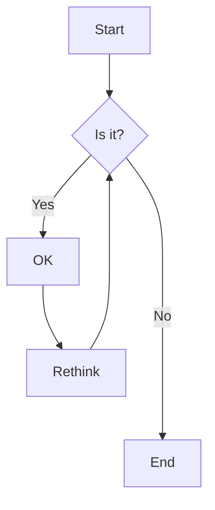

# Markdown API

VitePress provides a powerful Markdown processing pipeline with various extensions and APIs.

## Markdown Extensions

### 1. Frontmatter

YAML frontmatter is supported out of the box:

```yaml
---
title: My Page
description: A page with frontmatter
layout: default
---

# Content goes here
```

### 2. Custom Containers

Create custom containers with `::: container-name`:

```markdown
::: tip
This is a tip
:::

::: warning
This is a warning
:::

::: danger
This is a dangerous warning
:::

::: details
Click to expand

Hidden content here
:::
```

### 3. Line Highlighting

Highlight specific lines in code blocks:

````markdown
```js {1,3-5}
function add(a, b) {
  return a + b // Highlighted
}

const result = add(1, 2) // Also highlighted
console.log(result)
```
````

### 4. Line Numbers

Add line numbers to code blocks:

````markdown
```js:line-numbers
function add(a, b) {
  return a + b
}
```
````

### 5. Import Code Snippets

Import code from external files:

````markdown
```js
// @[code](../path/to/file.js)
```

```js
// @[code{2-4}](../path/to/file.js)
```
````

## Markdown Components

### 1. Custom Components

Create `.vue` files in `.vitepress/theme/components` to use them in Markdown:

````vue
<!-- .vitepress/theme/components/HelloWorld.vue -->
<template>
  <div class="hello">
    <h1>{{ msg }}</h1>
  </div>
</template>

<script setup>
defineProps({
  msg: String
})
</script>

<style scoped>
.hello {
  color: var(--c-brand);
}
</style>
````

Use in Markdown:

```markdown
<HelloWorld msg="Hello from Markdown" />
```

### 2. Built-in Components

VitePress provides several built-in components:

- `<Badge>` - Display badges
- `<CodeGroup>` - Group code blocks with tabs
- `<CodeBlock>` - Enhanced code block
- `<OutboundLink>` - External link with icon
- `<ClientOnly>` - Render component only on client-side

Example:

```markdown
<Badge type="tip">New</Badge>
<Badge type="warning">Beta</Badge>

<CodeGroup>
  <CodeBlock title="NPM">
  ```bash
  npm install my-package
  ```
  </CodeBlock>
  
  <CodeBlock title="Yarn">
  ```bash
  yarn add my-package
  ```
  </CodeBlock>
</CodeGroup>
```

## Markdown Extensions API

### 1. Custom Containers

Define custom containers in `.vitepress/config.js`:

```javascript
// .vitepress/config.js
export default {
  markdown: {
    config: (md) => {
      md.use(require('markdown-it-container'), 'warning', {
        validate: function(params) {
          return params.trim().match(/^warning\s+(.*)$/);
        },
        render: function (tokens, idx) {
          const m = tokens[idx].info.trim().match(/^warning\s+(.*)$/);
          if (tokens[idx].nesting === 1) {
            return '<div class="warning">' + md.utils.escapeHtml(m[1]) + '\n';
          } else {
            return '</div>\n';
          }
        }
      });
    }
  }
}
```

### 2. Custom Blocks

Add custom block syntax:

```javascript
// .vitepress/config.js
const container = require('markdown-it-container');

export default {
  markdown: {
    config: (md) => {
      md.use(container, 'custom-block', {
        render: function(tokens, idx) {
          if (tokens[idx].nesting === 1) {
            return '<div class="custom-block">';
          } else {
            return '</div>\n';
          }
        }
      });
    }
  }
}
```

Use in Markdown:

```markdown
::: custom-block
This is a custom block
:::
```

### 3. Custom Anchors

Customize header anchors:

```javascript
// .vitepress/config.js
import markdownItAnchor from 'markdown-it-anchor';

export default {
  markdown: {
    anchor: {
      level: [1, 2, 3],
      permalink: markdownItAnchor.permalink.headerLink({
        class: 'header-anchor',
        safariReaderFix: true
      })
    }
  }
}
```

## Markdown Plugins

### 1. Using markdown-it Plugins

Install and use markdown-it plugins:

```bash
npm install markdown-it-footnote
```

```javascript
// .vitepress/config.js
import footnote from 'markdown-it-footnote';

export default {
  markdown: {
    config: (md) => {
      md.use(footnote);
    }
  }
}
```

### 2. Custom Plugin Example

Create a simple plugin to add emoji support:

```javascript
// .vitepress/plugins/emoji.js
const emojis = {
  'smile': '😊',
  'heart': '❤️',
  'rocket': '🚀',
  // Add more emojis as needed
};

export default function emojiPlugin(md) {
  const pattern = new RegExp(`:(${Object.keys(emojis).join('|')}):`, 'g');
  
  const emojiRule = (state) => {
    const tokens = state.tokens;
    for (let i = 0; i < tokens.length; i++) {
      if (tokens[i].type === 'inline' && tokens[i].content) {
        tokens[i].content = tokens[i].content.replace(pattern, (match, name) => {
          return emojis[name] || match;
        });
      }
    }
  };
  
  md.core.ruler.after('inline', 'emoji', emojiRule);
}
```

Use the plugin:

```javascript
// .vitepress/config.js
import emojiPlugin from './plugins/emoji';

export default {
  markdown: {
    config: (md) => {
      md.use(emojiPlugin);
    }
  }
}
```

## Advanced Customization

### 1. Custom Renderer

Override the default renderer for specific tokens:

```javascript
// .vitepress/config.js
export default {
  markdown: {
    config: (md) => {
      const defaultRender = md.renderer.rules.fence;
      
      md.renderer.rules.fence = function(tokens, idx, options, env, self) {
        const token = tokens[idx];
        
        // Add custom class to code blocks
        if (token.info) {
          token.info += ' custom-code';
        } else {
          token.info = 'custom-code';
        }
        
        return defaultRender(tokens, idx, options, env, self);
      };
    }
  }
}
```

### 2. Custom Block Parser

Create a custom block parser:

```javascript
// .vitepress/plugins/custom-block.js
export default function customBlockPlugin(md) {
  function customBlock(state, startLine, endLine, silent) {
    const pos = state.bMarks[startLine] + state.tShift[startLine];
    const max = state.eMarks[startLine];
    
    // Check if it's our custom block
    if (state.src.slice(pos, pos + 3) !== '>>>') {
      return false;
    }
    
    // Parse the block
    const start = pos + 3;
    const end = state.skipSpacesBack(max, pos);
    const title = state.src.slice(start, end).trim();
    
    // Create token
    const token = state.push('custom_block_open', 'div', 1);
    token.attrSet('class', 'custom-block');
    token.attrSet('title', title);
    token.map = [startLine, startLine + 1];
    
    // Add content
    state.push('inline', '', 0).content = title;
    
    // Add closing token
    const tokenClose = state.push('custom_block_close', 'div', -1);
    
    // Update line
    state.line = startLine + 1;
    return true;
  }
  
  md.block.ruler.before('fence', 'custom_block', customBlock);
}
```

### 3. Markdown Hooks

Use hooks to modify the markdown-it instance:

```javascript
// .vitepress/config.js
export default {
  markdown: {
    config: (md) => {
      md.core.ruler.push('custom_rule', (state) => {
        // Process tokens here
        console.log('Processing markdown...');
      });
      
      // Add a hook after the markdown is parsed
      md.core.ruler.after('inline', 'custom_hook', (state) => {
        // Process tokens after inline processing
      });
    }
  }
}
```

## Markdown Extensions in Action

### 1. Mermaid Diagrams

Enable Mermaid.js diagrams:

```javascript
// .vitepress/config.js
export default {
  markdown: {
    config: (md) => {
      const defaultFence = md.renderer.rules.fence;
      md.renderer.rules.fence = function(tokens, idx, options, env, self) {
        const token = tokens[idx];
        if (token.info === 'mermaid') {
          return `<div class="mermaid">${token.content}</div>`;
        }
        return defaultFence(tokens, idx, options, env, self);
      };
    }
  }
}
```

Use in Markdown:

````markdown

````

### 2. Math Equations

Add support for LaTeX math equations:

```bash
npm install markdown-it-texmath
```

```javascript
// .vitepress/config.js
import texmath from 'markdown-it-texmath';
import katex from 'katex';

export default {
  markdown: {
    config: (md) => {
      md.use(texmath, {
        engine: katex,
        delimiters: 'dollars',
        katexOptions: { macros: { "\\RR": "\\mathbb{R}" } }
      });
    }
  },
  head: [
    ['link', { rel: 'stylesheet', href: 'https://cdn.jsdelivr.net/npm/katex@0.15.0/dist/katex.min.css' }]
  ]
}
```

Use in Markdown:

```markdown
Inline math: $E = mc^2$

Display math:

$$
\frac{1}{\sqrt{2\pi\sigma^2}} e^{-\frac{(x-\mu)^2}{2\sigma^2}}
$$
```

## Custom Theme Integration

### 1. Custom CSS for Markdown

Add custom styles for markdown elements:

```css
/* .vitepress/theme/style.css */
:root {
  --c-brand: #3eaf7c;
  --c-text: #2c3e50;
  --c-text-light: #476582;
}

/* Custom heading styles */
.vp-doc h1 {
  color: var(--c-brand);
  margin-bottom: 1rem;
}

.vp-doc h2 {
  border-bottom: 1px solid var(--c-border);
  padding-bottom: 0.5rem;
  margin: 2rem 0 1rem;
}

/* Custom blockquote styles */
.vp-doc blockquote {
  border-left: 4px solid var(--c-brand);
  background-color: var(--c-bg-light);
  margin: 1rem 0;
  padding: 1rem 1.5rem;
  border-radius: 4px;
}

/* Custom code styles */
.vp-doc pre {
  background-color: var(--c-bg-code);
  border-radius: 6px;
  padding: 1.25rem 1.5rem;
  overflow-x: auto;
}

.vp-doc code {
  font-family: 'Fira Code', monospace;
  font-size: 0.9em;
  background-color: var(--c-bg-code);
  padding: 0.2em 0.4em;
  border-radius: 3px;
}

/* Custom table styles */
.vp-doc table {
  display: block;
  border-collapse: collapse;
  margin: 1rem 0;
  overflow-x: auto;
}

.vp-doc th, .vp-doc td {
  border: 1px solid var(--c-border);
  padding: 0.6em 1em;
}

.vp-doc th {
  background-color: var(--c-bg-light);
  font-weight: 600;
}

/* Responsive images */
.vp-doc img {
  max-width: 100%;
  border-radius: 4px;
  margin: 1rem 0;
}

/* Custom container styles */
.custom-container {
  padding: 1.5rem;
  border-radius: 6px;
  margin: 1rem 0;
}

.custom-container.warning {
  background-color: rgba(255, 229, 100, 0.3);
  border-left: 4px solid #e7c000;
}

.custom-container.tip {
  background-color: rgba(66, 185, 131, 0.1);
  border-left: 4px solid #42b983;
}

/* Dark mode styles */
.dark .vp-doc {
  --c-bg-code: #2d2d2d;
  --c-text: #e0e0e0;
  --c-text-light: #a0a0a0;
  --c-bg-light: #2a2a2a;
}
```

## Extending Markdown with Components

### 1. Custom Alert Component

Create a custom alert component:

```vue
<!-- .vitepress/theme/components/CustomAlert.vue -->
<template>
  <div class="custom-alert" :class="[type]">
    <div class="custom-alert-icon">
      <component :is="iconComponent" />
    </div>
    <div class="custom-alert-content">
      <slot />
    </div>
  </div>
</template>

<script setup>
import { computed } from 'vue';
import { AlertCircle, AlertTriangle, Info, CheckCircle } from 'lucide-vue-next';

const props = defineProps({
  type: {
    type: String,
    default: 'info',
    validator: (val) => ['info', 'success', 'warning', 'danger'].includes(val)
  }
});

const iconComponent = computed(() => {
  const icons = {
    info: Info,
    success: CheckCircle,
    warning: AlertTriangle,
    danger: AlertCircle
  };
  return icons[props.type] || Info;
});
</script>

<style scoped>
.custom-alert {
  display: flex;
  padding: 1rem 1.5rem;
  border-radius: 6px;
  margin: 1rem 0;
  align-items: flex-start;
  gap: 0.75rem;
  border-left: 4px solid;
}

.custom-alert-icon {
  display: flex;
  align-items: center;
  margin-top: 0.25rem;
}

.custom-alert-content {
  flex: 1;
  min-width: 0;
}

.custom-alert :deep(p) {
  margin: 0;
  line-height: 1.7;
}

/* Type styles */
.custom-alert.info {
  background-color: var(--vp-c-bg-soft);
  border-color: var(--vp-c-brand);
  color: var(--vp-c-text-1);
}

.custom-alert.success {
  background-color: rgba(66, 185, 131, 0.1);
  border-color: var(--vp-c-green);
  color: var(--vp-c-green-darker);
}

.custom-alert.warning {
  background-color: rgba(255, 229, 100, 0.15);
  border-color: var(--vp-c-yellow);
  color: var(--vp-c-yellow-darker);
}

.custom-alert.danger {
  background-color: rgba(255, 100, 100, 0.1);
  border-color: var(--vp-c-red);
  color: var(--vp-c-red-darker);
}

/* Dark mode */
.dark {
  .custom-alert.success {
    color: var(--vp-c-green-light);
  }
  .custom-alert.warning {
    color: var(--vp-c-yellow-light);
  }
  .custom-alert.danger {
    color: var(--vp-c-red-light);
  }
}
</style>
```

Use in Markdown:

```vue
<CustomAlert type="info">
  This is an informational message.
</CustomAlert>

<CustomAlert type="success">
  Operation completed successfully!
</CustomAlert>

<CustomAlert type="warning">
  Warning: This action cannot be undone.
</CustomAlert>

<CustomAlert type="danger">
  Error: Something went wrong!
</CustomAlert>
```

## Conclusion

VitePress provides a powerful and flexible Markdown processing pipeline that can be extended to meet your documentation needs. With custom components, plugins, and styling, you can create rich, interactive documentation that looks great and is easy to maintain.
