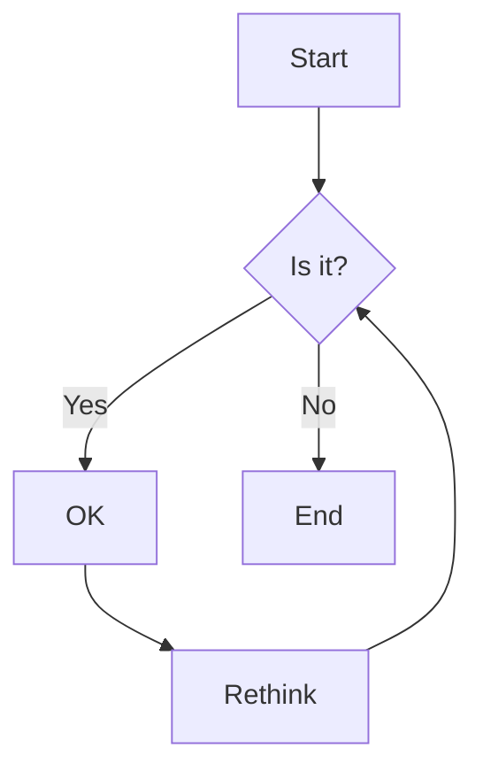

# Markdown Guide

This guide covers the Markdown syntax supported in our documentation.

## Headers

```markdown
# H1
## H2
### H3
#### H4
##### H5
###### H6
```

## Text Formatting

```markdown
**Bold** or __Bold__  
*Italic* or _Italic_  
~~Strikethrough~~  
`Inline code`  
```

## Lists

### Unordered List

```markdown
- Item 1
- Item 2
  - Nested Item 1
  - Nested Item 2
```

### Ordered List

```markdown
1. First item
2. Second item
   1. Nested item
   2. Another nested item
```

## Links and Images

```markdown
[Link text](https://example.com)

```

## Code Blocks

````markdown
```javascript
const hello = 'world';
console.log(hello);
```

```python
def hello():
    print("Hello, world!")
```
````

## Tables

```markdown
| Syntax      | Description |
| ----------- | ----------- |
| Header      | Title       |
| Paragraph   | Text        |
```

## Blockquotes

```markdown
> This is a blockquote
> with multiple lines
```

## Horizontal Rule

```markdown
---
```

## Custom Components

You can also use custom Vue components in your Markdown:

```vue
<CustomComponent>
  This will be rendered as a custom component
</CustomComponent>
```

## Emoji

:smile: :rocket: :tada:

## Footnotes

Here's a simple footnote[^1].

[^1]: This is the footnote.

## Task Lists

- [x] Write the press release
- [ ] Update the website
- [ ] Contact the media

## Mermaid Diagrams


